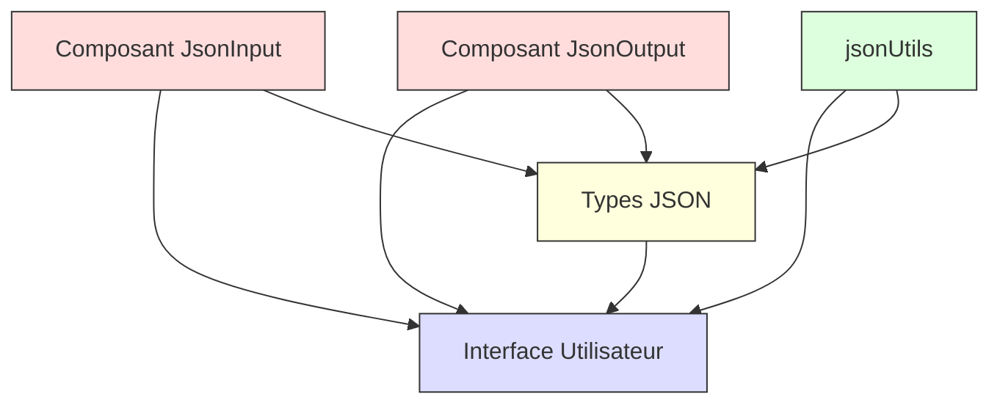

# JSON Template Generator

Un générateur de modèles JSON interactif et intuitif développé avec React et TypeScript.

🔗 [GitHub Pages](https://movinglive.github.io/json-template-generator/)

## 🌟 Caractéristiques

- Génération automatique de modèles JSON à partir de données existantes
- Interface utilisateur moderne et réactive
- Support du glisser-déposer pour les fichiers JSON
- Validation JSON en temps réel
- Copie en un clic et export des modèles générés
- Interface responsive et accessible

## 🔍 Architecture

## 🚀 Démarrage Rapide

### Installation

### Développement

### Production

## 🛠️ Technologies

- React 18
- TypeScript
- Tailwind CSS
- Vite
- Lucide React Icons

## 📚 Structure du Projet

## 🔄 Flux de Travail

1. Entrez ou uploadez votre JSON source
2. Vérification automatique de la validité
3. Génération du modèle avec types préservés
4. Export ou copie du résultat

## 🌐 Demo en Ligne

- Editer sur StackBlitz ⚡️

## 📦 Scripts Disponibles

- `npm run dev` - Lance le serveur de développement
- `npm run build` - Compile pour la production
- `npm run lint` - Vérifie le code
- `npm run preview` - Prévisualise la version de production

## 🤝 Contribution

1. Forkez le projet
2. Créez votre branche (`git checkout -b feature/AmazingFeature`)
3. Commitez vos changements (`git commit -m 'Add some AmazingFeature'`)
4. Poussez vers la branche (`git push origin feature/AmazingFeature`)
5. Ouvrez une Pull Request

## 📝 Licence

Distribué sous la licence MIT. Voir LICENSE pour plus d'informations.
